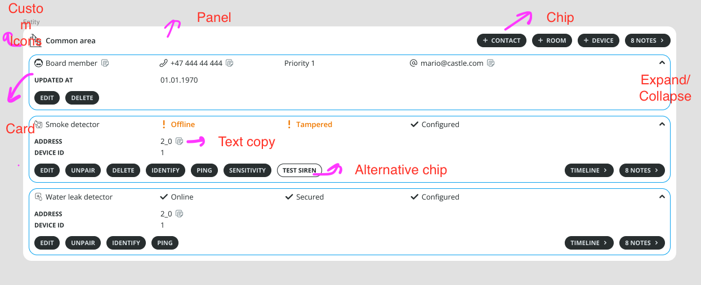

# future-home-coding-challenge

This repository holds all the source-code written in context of Future Home coding challenge. The following is the assignment description:

~~~
The challenge will be to re-create the design you see here:

[Link to Figma design file](https://www.figma.com/file/F4jegXGvRix0rZbGKYioQz/flutter_test_1).

Pretend that the code you write is part of a large collection of widgets used by several screens and also potentially multiple applications. The code should be well structured, performant, and easy to read and navigate through.

The end result should be a screen matching the look of the design file, and a collection of widgets that make up this screen.

You can assume that the application will be used on larger devices (web, iPad). The buttons do not have to do anything.

Upon completion, please provide a link to the GitHub repository where the code is stored.
~~~

## Rationale

Before getting our hands dirty in the source-code, we need to analyze the assignment and extract the requirements. The first line already tells us that we need to create a widget library which can be shared in multiple applications (i.e., package). We also have indication that different app platforms may use the code (e.g., iPad and Web), which indicates that we need to be careful with adaptive and responsive UI. There should also be an example app that showcases the design proposed in Figma, and the widgets configuration.

The other requirements are related to coding style and project structure. For this I will follow the coding style the majority of Flutter community adopts (e.g., trailing commas until code seems "pretty").

## Reviewing Figma design file

After grabbing the main requirements, I've decided to analyze the UI that has been proposed in the Figma design file. At a first glance, it seems that we need to create a simple design system as a package in Flutter.

After looking into every element, I've decided to note each unique element to then translate it as a widget. Using the Material Design terminology, I can see that there are:

- **Chips**, that can have text, prefix and suffix icons and may have alternate colors;
- **Expansion Tiles**, that can be expanded/collapsed;
- **Panel**, or a general purpose container that composes several expansion tiles within a context;
- **Custom icons**;
- And **text**, that can have prefix icons, different colors and be copied.

## Demo

**Web**

https://user-images.githubusercontent.com/26190214/177897445-33fd88a1-dd8b-48cb-bf9d-555f416d7577.mov

**iPad Air**

https://user-images.githubusercontent.com/26190214/177897471-2e7fd1b8-edaa-4d01-884d-5506b4f630fe.mp4

## Improvements

Had issues exporting icons from Figma (used Icomoon for translating `.svg` to `.ttf`), which left some icons to not be fully rendered. The content text in the expansion tiles widgets are also not aligned, which doesn't exactly match the proposed design.

## Try it

You can try the example application right away on the web:

http://oshanu.art/future-home-live/